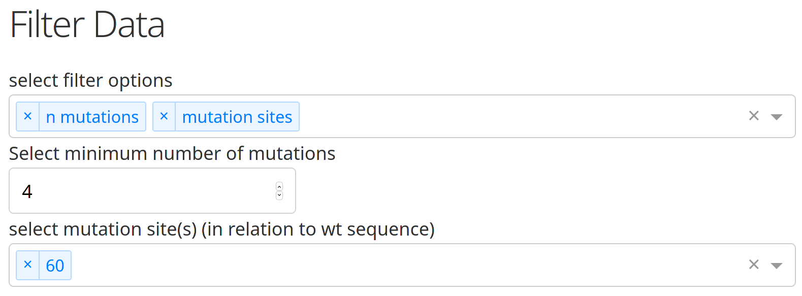
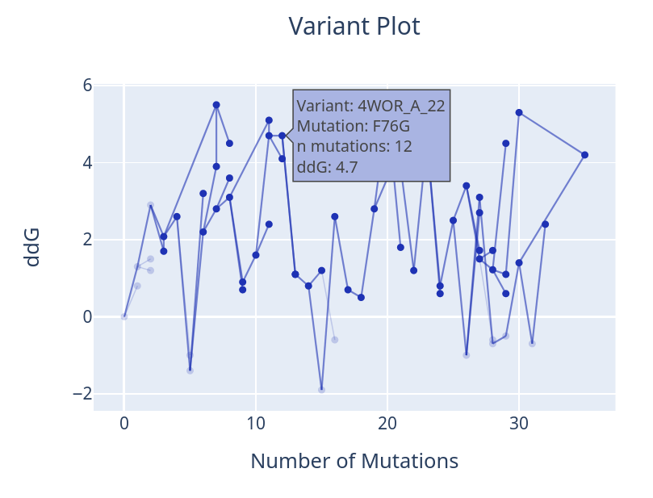
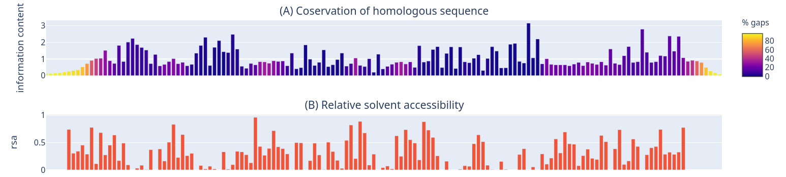
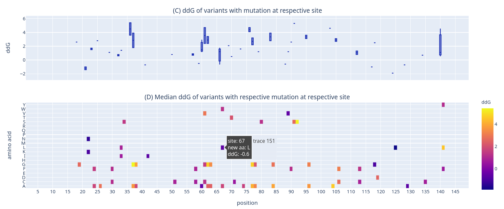
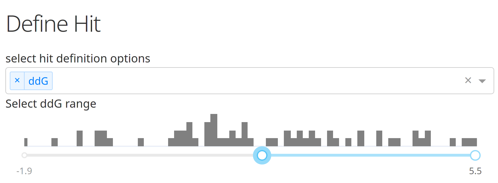
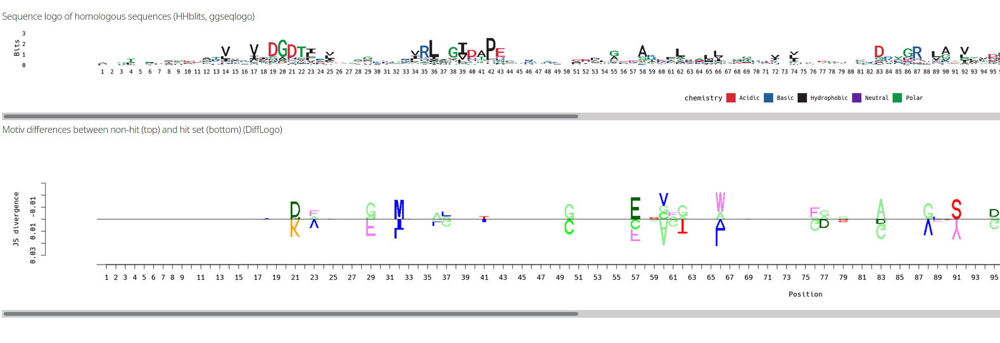

# Local Dashboard

## Installation

- clone this repo
```
git clone https://github.com/HenriettaHolze/PrEnDa.git
```

### Conda
- make conda env from yaml file
```
conda env create -f PrEnDa/env.yaml
source activate PrEnDa
```
#### Quick guide

To start the dashboard using one of the provided example data sets, run:
```
source activate PrEnDa
python PrEnDa/dashboard_local.py
```
When you click the link in the terminal, the dashboard should open in your browser. The dashboard runs on port 8050

To use the other example dataset:
```sh
DATA_PATH="example_data/gssm" python dashboard_local.py
```

### Docker
You can also create a docker container

```
cd PrEnDa
docker build -t prenda_image .
docker run -it --rm -p "8050:8050" --name prenda_container prenda_image
```
If you want to use the other example data set, mount the directory to a data directory inside the app. 
```
docker run -it --rm -p "8050:8050" --name prenda_container -v "$(pwd)/example_data/gssm:/app/data" prenda_image
```

## Components

### Filter

You can filter the initial data set if you only want to look at specific variants, e.g. variants with a certain number of mutations or mutations at a specific site. 



### Variant plot

The variant plot is informative for the directed protein engineering approach. It shows the parent-variant relations and when variants lineages are merged (mind that the example data is only simulated).



### Conservation and RSA plots

Conservation and relative solvent accessibility give information on how a residue might react to mutation. Mutations of highly conserved residues in the core are likely to be deletirious while changes in less conserved residues can improve stability. 



### Attribute plots

In the example data, ddG was chosen as attribute of the variants. The box plot shows the range in ddG for mutations at a respective site (GSSM data) and the heatmap gives exact information which substitutions are adventageous. 



### Hit definition

If you want to compare subsets of the data, you can define a 'hit', e.g. proteins with a high ddG vs low. 



### Sequence logos

The first sequence logo shows homologouse sequences (retrieved with HHblits), showing conservation and variants that appear in nature. The second logo shows a DiffLogo, comparing hits vs non-hits. 




## Data

2 example datasets are provided: one from a gene site saturation mutagenesis (GSSM) experiment and one simulating a directed protein engineering approach (directed).
The original data was retrived from the [FireProt](https://loschmidt.chemi.muni.cz/fireprotdb/) database. Data for protein [4WOR](https://www.rcsb.org/structure/4WOR) was used for the GSSM data and for simulating the directed engineering data. 


## Individual data exploration

To explore your own data, you must provide a directory containing the following files:

- variant data csv `data.csv`
    - variant column: unique variant ID
    - parent column: variant ID of parent(s), separated by space if multiple (merge of 2 variants) or empty for the origin/wild-type
    - mutation column: 1-indexed mutations that are new in relation to parent variant, space separated
    - attribute column: one numeric attribute of variants

- settings file `settings.json`
    - json file that maps column headers of the data.csv file to the different column types
    - columns that are not specified, will be ignored

```
{
    "name": "4WOR_A_GSSM",
    "column_definitions": {
        "variant": "variant",
        "parent": "parent",
        "mutation": "mutation",
        "attribute": "ddG"
    }
}
```

- protein sequence fasta file `protein.fasta`
    - protein sequence of wild type or origin of directed engineering experiment

- PDB file `protein.pdb`

- MSA fasta file with homologous sequences `msa.fasta`
    - can be made with [HHblits](https://toolkit.tuebingen.mpg.de/tools/hhblits)
    - resulting a3m file can be converted to fasta file with `reformat.pl` [script](https://github.com/soedinglab/hh-suite/blob/master/scripts/reformat.pl) from the HHsuite  
    `./reformat.pl a3m fas <HHBLITS_A3M_FILE> <HHBLITS_FASTA_FILE> -r`

In order to run the dashboard with your own data, you have to either set the environment variable `DATA_PATH` or mount the data on the Docker container. 
- You can simply run the dashboard with `DATA_PATH="<data_path>" python dashboard_local.py`. This will set the environment variable. Alternatively create a `PrEnDa/data/` directory and copy the files into it.
- Or run `docker run -it --rm -p "8050:8050" --name prenda_container -v "<data_path>:/app/data" prenda_image`